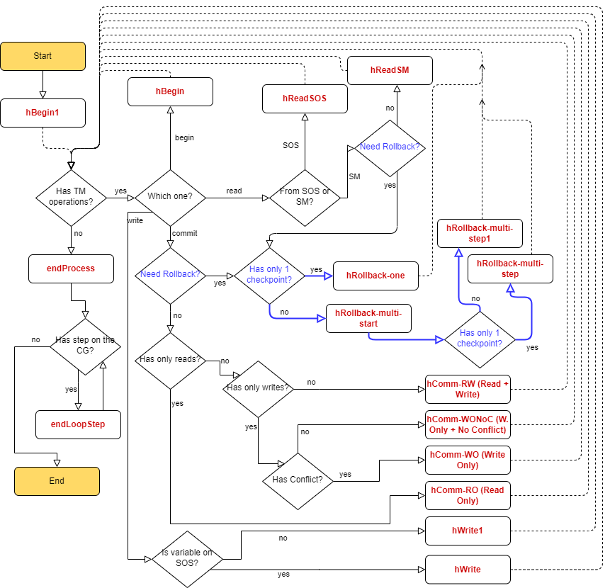

> # Graph Transformation System for Transactional Memory Algorithms
>
> This is a description of a GTS to prove opacity of TM algorithms.

Rules to process the history:

```
# Begin
- hBegin
- hBegin1

# Read
- hReadSM
- hReadSOS

# Write
- hWrite
- hWrite1

# Commit
- hCommit-RO (Read Only)
- hComm-RW (Read + Write)
- hComm-WO (Write Only)
- hComm-WONoC (Write Only No Conflict)

# Rollback
- hRollback-one
- hRollback-multi-start
- hRollback-multi-step
- hRollback-multi-step1
```

Rules that process the conflict graph:

```
- endProcess    : ends the processing of the history and starts the conflict graph
- endLoopStep   : paths through the conflict graph
```

Contitional rules:

```
- endLoopStart
- endCyclic
```

Flowchart of how to apply rules:


